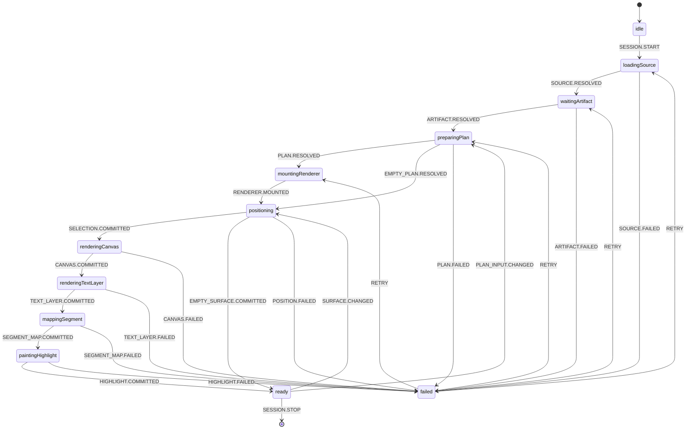

# Reader Readiness State Machine

Status: architecture decision and migration artifact. The current PDF readiness
rewrite is rejected and must be reset before this design is implemented.

This document supersedes the PDF portion of Step 24 in
`PLAYBACK_ARCHITECTURE.md`. It does not weaken the blocking reader contract:
PDF, EPUB, and HTML remain unusable until their authoritative plan, selected
position, rendered surface, and initial segment highlight are ready.

## Decision

Use XState v5 with `@xstate/react` for one reader-session actor per mounted
reader. Keep TanStack Query as the owner of remote server snapshots and cache.
Do not add Zustand for reader orchestration.

XState is selected because this problem is an event-driven workflow with
ordered states, cancellation, invoked work, stale events, and explicit failure
transitions. Zustand is an intentionally unopinionated store; moving the current
booleans into it would centralize the ambiguity without defining legal
transitions or ownership. TanStack Query remains responsible for metadata,
settings, progress, parsed-artifact snapshots, and plan-operation snapshots;
the reader actor consumes those results as events.

References:

- [XState documentation](https://stately.ai/docs)
- [XState actors](https://stately.ai/docs/actors)
- [XState React integration](https://stately.ai/docs/xstate-react)
- [Zustand introduction](https://zustand.docs.pmnd.rs/learn/getting-started/introduction)
- [TanStack Query overview](https://tanstack.com/query/latest/docs/framework/react/overview)

There will be no runtime compatibility adapter, legacy event translation,
feature-flagged dual reader, re-export layer, or old/new fallback. Each reader
type moves by hard cut after its replacement passes its acceptance suite. The
old implementation and obsolete state are deleted in the same migration.

## Non-Negotiable Readiness Contract

A readable PDF surface is revealed only after all of the following facts belong
to the same session and surface identity:

1. Document bytes are loaded.
2. The parsed PDF artifact is ready and valid.
3. The matching worker playback plan is ready, validated, and applied.
4. One worker-plan ordinal is explicitly selected for the intended start
   location. A loaded plan never implies ordinal zero.
5. The active PDF.js page canvas is committed.
6. The active page text layer is committed.
7. The exact selected segment is mapped from its canonical worker anchor into
   that text layer.
8. The initial segment highlight is painted.
9. Only then does the machine enter `ready` and reveal the reader and controls.

If highlighting is disabled by user settings, step 8 becomes an explicit
no-paint commit owned by the same surface identity; it is not inferred from the
absence of a highlight. If word highlighting is enabled, word projection
capability must be established before readiness, although no word overlay is
expected until audio supplies an active word.

A valid zero-segment plan is an explicit terminal preparation result. It may
reveal a non-playable document only after the renderer has committed the saved
or default surface. It must not synthesize a segment or wait for an impossible
selection.

## Why the Current System Failed

Commit `c00a7ab` changed previously independent, mostly informational signals
into blocking conditions without replacing their contracts. The resulting
system combines values such as `isLoading`, `parseStatus`,
`playbackPlanLifecycle`, `isPlaybackReady`, `isPdfViewerReady`,
`textLayerRenderRevision`, and `currentSegment`, but those values describe
different work and do not share an owner identity.

Consequences include:

- A canvas event from one page can satisfy a plan selection for another page.
- A text-layer revision says that some layer rendered, not which selection it
  can project.
- `currentSegment === null` can mean not selected yet, empty plan, stale plan,
  navigation in progress, or selection failure.
- A boolean highlight result cannot distinguish waiting for a text layer from a
  deterministic mapping failure.
- Effects can republish errors or readiness while reacting to state caused by
  their own callback.
- Timer retries hide missing ownership and make readiness depend on scheduling.
- The rejected geometry change treated a worker block rectangle as proof that
  the exact selected text segment was mapped. It was not proof, and it moved
  expensive token matching back onto the main thread.

The problem is not that PDF must remain blocked. It must remain blocked. The
problem is that the current signals cannot prove that all blocking prerequisites
describe the same selected surface.

## Reset Boundary

The current uncommitted PDF implementation is not a base for incremental repair.
Reset the following files to the last known-working pre-`c00a7ab` baseline as
one unit:

- `src/app/(app)/pdf/[id]/page.tsx`
- `src/app/(app)/pdf/[id]/usePdfDocument.ts`
- `src/components/views/PDFViewer.tsx`
- `src/lib/client/pdf.ts`
- `src/lib/client/pdf-highlight-worker.ts`
- `src/components/reader/PdfLayoutScan.tsx`
- `src/components/reader/PdfLayoutScan.module.css`

Remove the experimental `tests/unit/pdf-highlight-geometry.vitest.spec.ts` with
that reset. This restores a known functional PDF baseline; it does not declare
the baseline architecture correct. Its timer retries and client text matching
are temporary debt that will be deleted by the PDF hard cut, not copied into
the state machine.

Preserve the current EPUB and HTML improvements, worker-plan ownership and
recovery work, stable EPUB progress, and strict progress codecs. Preserve the
shared phase loader for EPUB and HTML. PDF rejoins that shared presentation only
after the PDF machine adapter satisfies the exact readiness contract.

## Identity and Ownership

Every event that can advance readiness carries both identities below. An event
with a non-current identity is discarded and cannot mutate context, report an
error, or complete a later surface.

```ts
type ReaderSessionKey = {
  documentId: string;
  readerType: 'pdf' | 'epub' | 'html';
  sourceRevision: string;
  settingsSignature: string;
};

type ReaderSurfaceKey = {
  sessionKey: ReaderSessionKey;
  planSignature: string;
  selectedOrdinal: number | null;
  location: string;
  rendererRevision: number;
  layoutKey: string;
};
```

The session actor is the only owner of the current keys. Renderer adapters may
report facts but may not independently declare the reader ready.

## Machine Topology



The implementation may use nested or parallel states where it improves
clarity, but it must preserve the ordered proof required to enter `ready`.
Failures retain their stage and retry target instead of collapsing into one
ambiguous `error` flag.

## Event Contract

The actor accepts explicit facts, never generic `isReady` callbacks:

- `SESSION.START` / `SESSION.STOP`
- `SOURCE.RESOLVED` / `SOURCE.FAILED`
- `ARTIFACT.RESOLVED` / `ARTIFACT.FAILED`
- `PLAN.RESOLVED` / `PLAN.FAILED`
- `SELECTION.COMMITTED` / `POSITION.FAILED`
- `RENDERER.MOUNTED`
- `CANVAS.COMMITTED` / `CANVAS.FAILED`
- `TEXT_LAYER.COMMITTED` / `TEXT_LAYER.FAILED`
- `SEGMENT_MAP.COMMITTED` / `SEGMENT_MAP.FAILED`
- `HIGHLIGHT.COMMITTED` / `HIGHLIGHT.FAILED`
- `EMPTY_PLAN.RESOLVED` / `EMPTY_SURFACE.COMMITTED`
- `SURFACE.CHANGED` / `PLAN_INPUT.CHANGED`
- `RETRY`

All asynchronous work is invoked or owned by a state. Leaving that state
cancels or invalidates its work. A late promise, PDF.js callback, EPUB rendition
event, or DOM observation cannot complete the new state unless its full owner
key matches.

Adapter operations return discriminated outcomes rather than booleans:

```ts
type SurfaceCommitResult<T> =
  | { status: 'committed'; surfaceKey: ReaderSurfaceKey; value: T }
  | { status: 'pending'; surfaceKey: ReaderSurfaceKey; reason: string }
  | {
      status: 'failed';
      surfaceKey: ReaderSurfaceKey;
      stage: 'canvas' | 'text-layer' | 'segment-map' | 'highlight';
      error: Error;
      retryable: boolean;
    };
```

`pending` is not an error and cannot reveal the reader. It causes the machine to
wait for a named prerequisite event, not schedule a timer loop.

## PDF Projection Hard Cut

The current parsed PDF fragment identity—page, rectangle, text, and reading
order—is insufficient to project an exact worker segment into PDF.js DOM. Text
search and rectangle overlap are heuristics; they cannot be readiness proof.

The compute worker must emit a new parsed PDF artifact schema containing stable
PDF text-item identity for every block fragment. At minimum, each fragment must
retain its source PDF.js item indices and character slices when a block starts
or ends inside an item. Cross-page blocks retain separate per-page fragments.
The parser version and artifact address change together so old artifacts are
reparsed. There is no schema-v1 compatibility reader.

After `onRenderTextLayerSuccess`, the PDF adapter publishes a DOM map from those
item indices to their concrete text nodes and offsets for the active page and
renderer revision. The selected plan segment's canonical block offsets are then
projected through the fragment item ranges into an exact DOM `Range`. Readiness
requires painting that range successfully.

The final path has:

- no page-wide text search;
- no geometry-only readiness;
- no synchronous full-page token matching on the main thread;
- no highlight retry timers;
- no alternate highlight fallback;
- no canvas event from an inactive page satisfying the active page;
- no reveal before the exact initial highlight commit.

Geometry may still be used for non-text visual blocks or scrolling, but such a
surface has an explicit non-text outcome. It cannot masquerade as a mapped text
segment.

## Reader Adapters

The machine owns orchestration; each adapter owns only renderer-specific facts:

- PDF maps stable parsed text-item identities to PDF.js DOM ranges and reports
  active canvas/text-layer/highlight commits.
- EPUB maps stable spine coordinates to the current rendition DOM ranges and
  reports committed relocation and paint results.
- HTML maps canonical block offsets directly into the rendered block tree and
  reports layout and paint results.

Adapters do not fetch plans, select speculative ordinals, expose reader-level
loading booleans, or translate failures into another reader's event shape.

## Migration Sequence

### Phase 0 — Restore the PDF Baseline

Reset the rejected PDF slice listed above and smoke-test first open, saved-page
resume, page turns, scroll/dual-page layouts, and initial highlighting. Record
known baseline defects without trying to fix them in the reset.

### Phase 1 — Build the Pure Session Machine

Add XState v5 and `@xstate/react`. Implement the machine, typed keys, guards,
events, and model tests without connecting a production reader. TanStack Query
results enter through a small integration boundary; query ownership does not
move into a global client store.

### Phase 2 — Produce Exact PDF Projection Identity

Bump the parsed PDF artifact schema and parser version. Preserve PDF text-item
indices and character slices through worker parsing and playback-plan anchors.
Add worker fixtures proving repeated text, split spans, ligatures, whitespace,
and cross-page fragments retain stable identity.

### Phase 3 — Hard-Cut PDF

Connect one PDF session actor and the new projection adapter. Pass the complete
PDF acceptance suite, then delete the old PDF effects, timer retry loops,
highlight worker, page-text search, and ambiguous readiness flags in the same
change. Do not run the old and new PDF paths in parallel.

### Phase 4 — Hard-Cut HTML

Move HTML's already-working canonical block mapping behind the same machine
contract. Delete the replaced HTML loading/highlight orchestration immediately.

### Phase 5 — Hard-Cut EPUB

Move the stable spine-locator flow behind the session machine while retaining
its current single-display and plan-backed placement semantics. Delete the
replaced EPUB placement lifecycle rather than wrapping it.

### Phase 6 — Remove Shared Ambiguity

Delete `deriveReaderLoadState` and reader-level readiness booleans once no
reader consumes them. The loader renders the machine state directly. Repository
search must find no compatibility adapters, re-export modules, timer retries,
or renderer callbacks named as generic readiness facts.

## Verification and Acceptance

Pure machine tests must cover every legal transition plus stale events for a
previous document, plan signature, ordinal, page, layout, and renderer revision.
They must prove that no failure callback can recursively trigger itself and
that `ready` is unreachable without the complete ordered commit chain.

PDF adapter and browser coverage must include:

- first open and saved-page resume;
- exact initial highlight visible before reveal;
- rapid page turns and playback-follow navigation;
- scroll, single-page, and dual-page layouts;
- zoom, resize, and settings/plan-signature changes;
- React Strict Mode remount behavior;
- repeated text and segments split across PDF.js spans;
- a pending text layer that later commits without polling;
- deterministic mapping failure that remains blocked and reports one staged
  error;
- empty and non-text plans;
- no long synchronous token match and no timer retry loop on the main thread.

Signed-in tests using the user's private documents remain required because the
agent cannot access that account or those files. They supplement rather than
replace deterministic fixtures and automated state-machine coverage.

## Definition of Done

The architecture is complete only when all three readers use one typed session
machine, each production adapter has one exact mapping/highlight path, PDF
projection is identity-based rather than heuristic, the reader is never
revealed before its initial surface commit, and the replaced flags, effects,
timers, compatibility shims, fallbacks, and re-exports have been deleted.

Until then, Step 24 is reopened and the restored PDF implementation is an
explicit temporary baseline—not the target architecture.
